# Mapbox in ASP.NET React

## prerequisites

- .NET 3.1 preview
- Node
- React

Omdat er gewerkt wordt met React wordt het aanbevolen om met visual studio code of een andere webdevelopment gerichte IDE te werken. Visual studio gaat niet zo goed om met React. Binnen visual studio kan er gebruik gemaakt worden van een knop om de code te builden en uit te voeren maar in deze workshop wordt er gebruik gemaakt van de commandline.

## Stap 1 Project setup

Kies een locatie voor dit project en kopieer het pad. Open een command line interface, navigeer naar de gewenste locatie en voer het volgende commando uit om volgens het ASP.NET react template een project te maken:

```
dotnet new react -o map-box-workshop
```

Vervolgens wordt de library die we gebruiken geïnstalleerd. In deze workshop wordt de library react-map-gl gebruikt als react wrapper voor mapbox gl js. Deze library is ontwikkeld door Uber. Navigeer naar de map binnen het project genaamd: 'ClientApp'
Als je dezelfde naam als hierboven gebruikt hebt voor jouw project kan dat met het volgende commando:

```
cd map-box-workshop/ClientApp
```

Voer hierna het volgende commando uit:

```
npm install --save react-map-gl
```

Wanneer dit uitgevoerd wordt, worden alle andere npm packages ook geïnstalleerd. Dit kan heel erg lang duren dus ondertussen kunnen er alvast een aantal andere dingen geregeld worden.

In deze repo staan de volgende twee bestanden: airbnblocations.json en map-marker.png. Maak binnen de source map van de ClientApp de mappen 'geoData' en 'images' aan. Download de bestanden en plaats ze in deze mappen.

Vervolgens heb je ook nog een een mapbox accestoken nodig. Zonder deze token krijg je het volgende te zien op je scherm wanneer je mapbox implementeert:

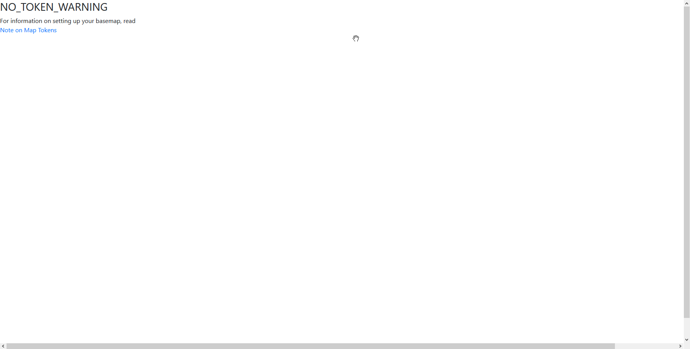
Om de token te krijgen moet je een account maken op https://www.mapbox.com/  Wanneer je een account aangemaakt hebt en navigeert naar je profiel staat er een kopje 'Token' hier kun je jouw token vandaan halen.

Hopelijk is de npm install nu klaar. Anders kun je jezelf even vermaken met dit: https://www.youtube.com/watch?v=PLOPygVcaVE

Wanneer dit uiteindelijk klaar ga terug naar de hoofdmap met:

```
cd ../
```

En voer het volgende commando uit:

```
dotnet build
```

Hierna kan de applicatie opgestart worden met het volgende commando:

```
dotnet run
```

Open nu https://localhost:5001 in je browser. Als het goed is krijg je de volgende voorbeeld webapplicatie geopend:
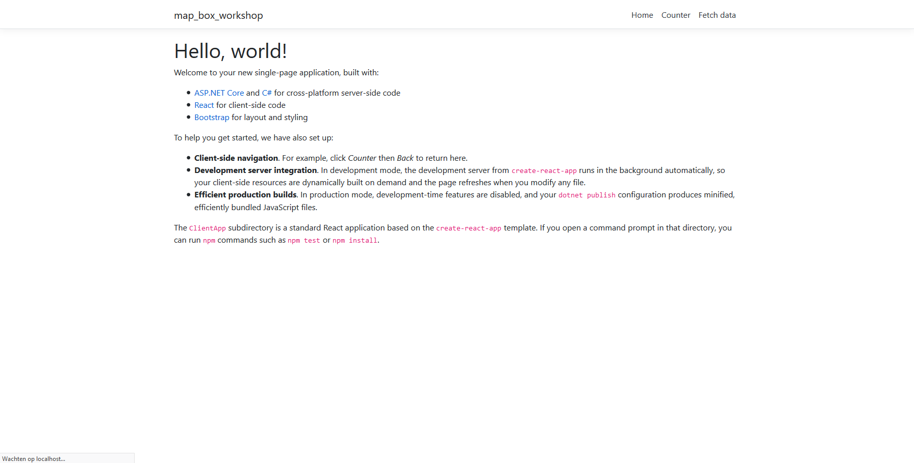

Nu kunnen er wat bestanden verwijdert worden die we niet nodig hebben. In de components map binnnen de src van de ClientApp kunnen de volgende bestanden verwijdert worden:

- Counter.js
- FetchData.js
- Layout.js
- NavMenu.js
- NavMenu.css

Het bestand Home.js kunnen de regels 4 en 9 t/m 22 verwijdert worden om zo een leeg Home component over te houden die we zo gaan opvullen. Als laatste moet de App.js nog aangepast worden. De return binnen de render methode van App.js kan leeggehaald worden en vervangen worden met:

```js
<Home />
```

Vervolgens moeten ook nog de nu onnodige imports verwijdert worden.

Als het goed is ziet de file structure er nu ongeveer als volgt uit:

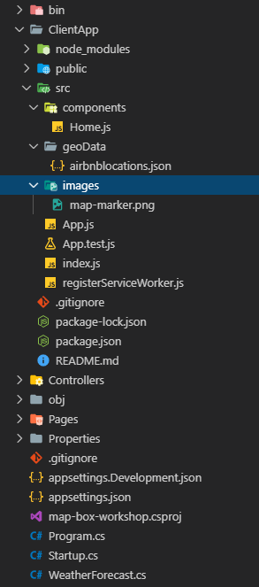

App.js en Home.js zien er dan als volgt uit:

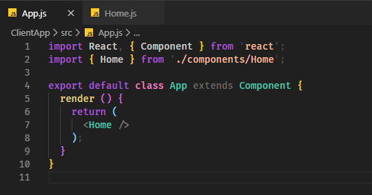

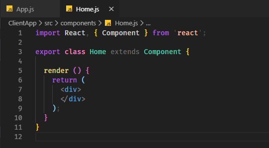

## Stap 2 Mapbox implementeren

Nu kan er begonnen worden aan het implementeren van mapbox.

Open Home.js in dit bestand wordt dalijk alle code geschreven.

Voeg boven in het bestand de volgende code toe:

```js
import ReactMapGL from "react-map-gl";
```

Voeg een constructor toe aan het home component en vul de initial state met de volgende data:

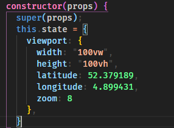

Hiermee beschrijf je hoe groot je de map wil maken maar ook de startpositie van het viewpoint en de zoom. Met deze coördinaten start het viewpoint op Amsterdam. De nummers in deze state worden constant verandert wanneer de gebruiker zijn locatie op de kaart verandert of zijn zoom verandert.

Implementeer nu het ReactMapGL component zoals hieronder weergegeven:

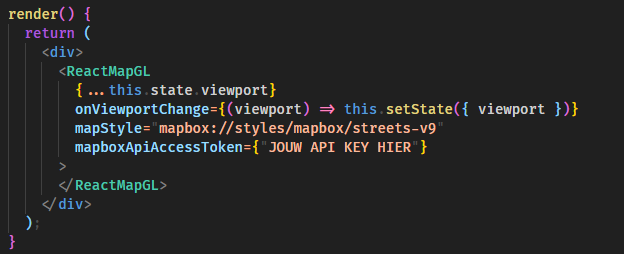

Let op de "onViewportChange" handler. Dit is de handler die de state verandert wanneer de gebruiker rondbeweegt op de kaart.
mapStyle geeft de gebruiker de optie om het uiterlijk van de kaart te veranderen. Er zijn online een heel aantal styles te vinden maar degene die in deze workshop gebruikt wordt is het meest gebruikelijk. Let er ook op de je hier ook je apiAccestoken moet invullen. Het is natuurlijk een goed idee om die token in een .env bestand te zetten maar voor deze workshop maakt dat niet heel veel uit.

Open nu https://localhost:5001/ als het goed is krijg je een grote kaart op je scherm te zien.

## Stap 3 Layers toevoegen

De wereld kunnen verkennen in je browser is natuurlijk leuk maar niet heel nuttig. Gelukkig kun je in mapbox eigen data toevoegen en dit weergeven op de kaart. Ook kun je andere 'layers' bovenop de kaart plaatsen. In dit geval moeten alle layers tussenn de opening en closing tags van het ReactMapGL component geplaatst worden.

voeg eerst de volgende twee imports aan Home.js toe:

```js
import mapMarker from "../images/map-marker.png";
import * as geoDataLocations from "../geoData/airbnblocations.json";
```

Hiermee wordt er alvast een plaatje ingeladen die we zometeen als marker gaan gebruiken en wordt ook de custom data ingeladen. In dit geval slaan wij het geojson bestand op in de frontend. Dit is puur voor deze workshop maar het is uiteindelijk wel de bedoeling om het bestand op de backend te zetten en het in de frontend van de backend op te vragen.

Omdat de data in een json bestand is opgeslagen kan er met javascript makkelijk mee gewerkt worden. Bestudeer eerst even het bestand: 'airbnblocations.json'. Wat als het goed is opvalt is dat het bestand een array van 'features' bevat. Elke feature is in dit geval een locatie op de kaart. Elke feature heeft een grote hoeveelheid eigenschappen die wij kunnen gebruiken in onze applicatie.

Maar laten we eerst even simpel markers weergeven op de kaart. verander bovenin Home.js de ReactMapGL import naar:

```js
import ReactMapGL, { Marker } from "react-map-gl";
```

Omdat alle locaties in een array staan kunnen we met een map heel makkelijk over deze locaties itereren en ze transformeren naar een marker component. Dit kun je als volgt doen:

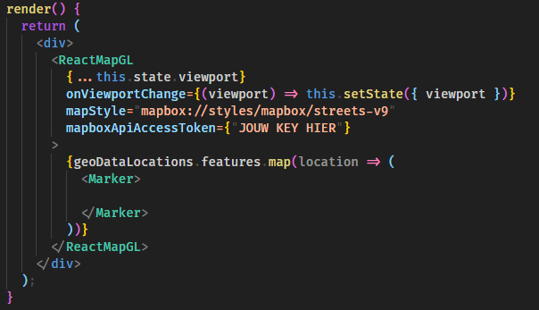

Er mist nu nog wel iets aan de code. Als je nu het resultaat probeert weer te geven in je webbrowser loopt dat niet goed af. De markers weten namelijk niet waar ze zichzelf moeten plaatsen. Om dit op te lossen moeten er nog een lattitude en longitude meegegeven worden aan het marker component. Ook moet er volgens react conventies een unieke key aan elk marker component toegevoegd worden.

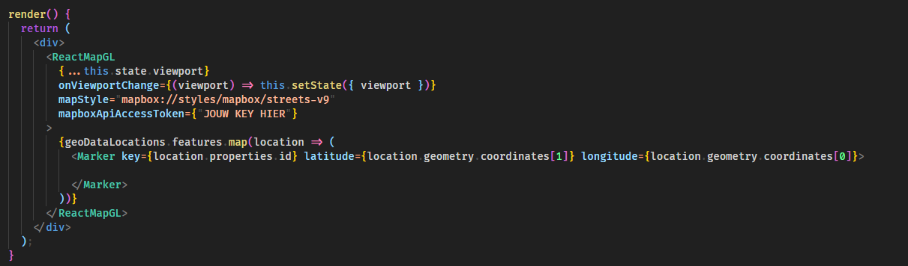

Bestudeer zelf even het data json bestand om te zien waarom hierboven de data opgehaald wordt op deze manier.

Ondanks dat ze nog niet weergegeven worden op de kaart heb je nu wel markers toegevoegd op basis van de data. Het is nu tijd om ze zichtbaar te maken. Hiervoor kun je gewoon html componenten gebruiken. De conventie is om buttons te gebruiken om het zo mogelijk te maken om events toe te voegen aan de markers.

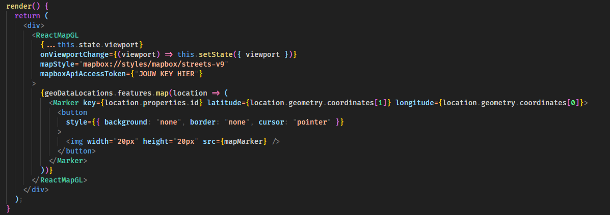

Als het goed is worden er nu markers weergegeven op de kaart.

Nu gaan we als laatste nog een custom layer toevoegen en een onclick event handler toevoegen aan de location markers.

Voeg eerst de volgende code toe onder de geoDataLocations map functie:

```js
{geoDataLocations.features.map(airbnb => (
...
))};
<div style={{ width: "15vw", height: "auto", backgroundColor: "lightgrey", boxShadow: "2px 2px 4px #000000" }}>
  <h2>Selected location:</h2>
</div>
```

Deze code voegt linksboven in je scherm een klein venster toe wat wij gaan opvullen met data. 

Eerst moet er bijgehouden worden of er een locatie geselecteerd is en zo ja welke. Dit wordt gedaan in de state. Voeg in de initiële state die aangemaakt wordt in de constructor het volgende toe:

```js
selectedLocation: null
```

Voeg in de button component een onClick event handler toe. In deze workshop bouwen wij hiermee een functie die een object met wat data over de geklikte marker in de state zet.

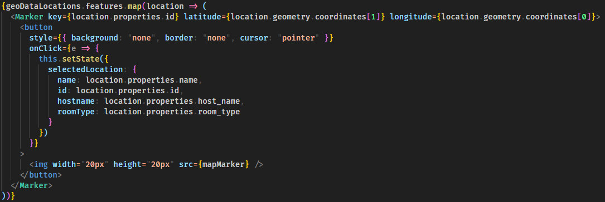

In bovenstaande code wordt er een object aangemaakt met een 'name', 'id', 'hostname' en 'roomType'. Kijk zelf ook even nog naar de geoData en besluit zelf welke gegevens je wil gebruiken.

Als laatste moet er nog een functie toegevoegd worden die de inhoud van de box geeft. Je kunt de box opvullen zoals je zelf wil. Bijvoorbeeld zo:

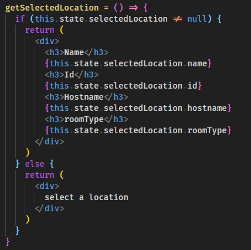

Open nu je browser. Als het goed is zie je markers op de kaart en wanneer je op een marker klikt worden er wat details over de locatie linksboven in het scherm weergegeven.
